# 五矿集团

> 网站地址： aHR0cHM6Ly9lYy5taW5tZXRhbHMuY29tLmNuL2xvZ29uQWN0aW9uLmRv
>
> https://github.com/Guapisansan/gpss_learn_reverse 代码在这里，会持续更新逆向案例

**免责声明： 此文档，以及脚本，仅用来对技术的学习与探讨，如有冒犯，请联系作者电话，微信13933566015进行删除**

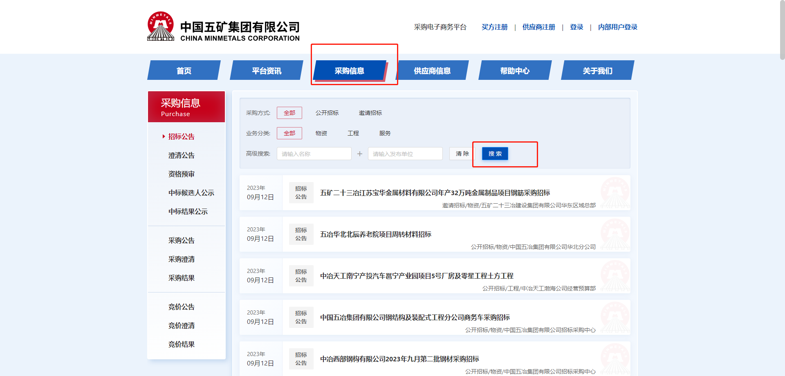

这里点击采购信息，来看一下这个搜索接口吧

## 分析流程

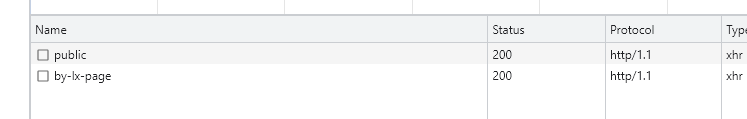

点击搜索弹出俩了两个接口

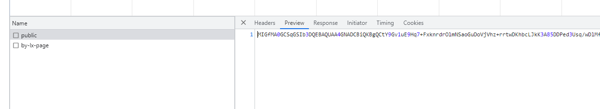

第一个像一个rsa公钥，public接口名称也像是公钥

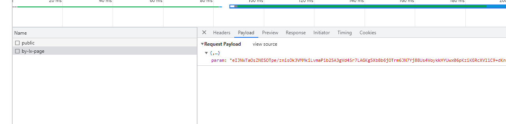

第二个接口是一个param参数加密的

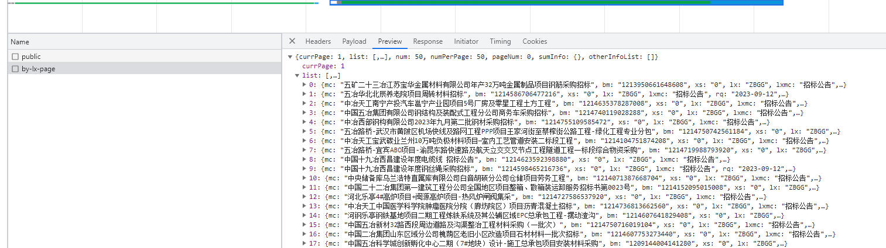

响应没有密文，还是比较友好。

先重放一下看看去除一些不必要参数。

经过测试这里有 ua检测

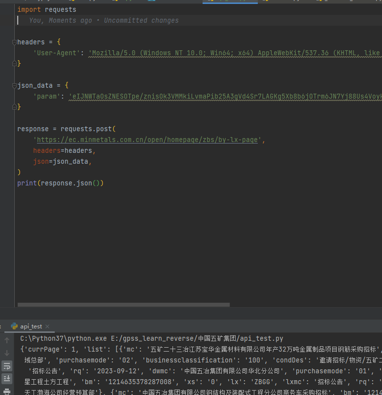

所以ua要加上，其他的可以去掉。

所以我们只要把param参数拿到就ok了

## 逆向分析

### param

跟一下这个加密吧

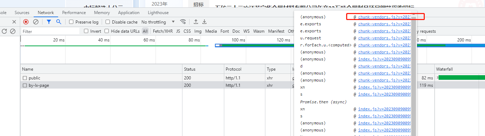

在这地方下个断点，点击搜索按钮

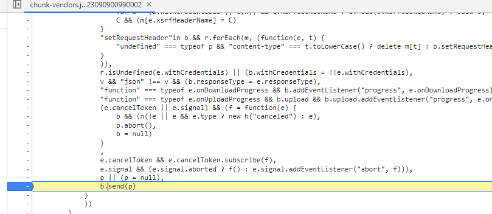

向前跟栈

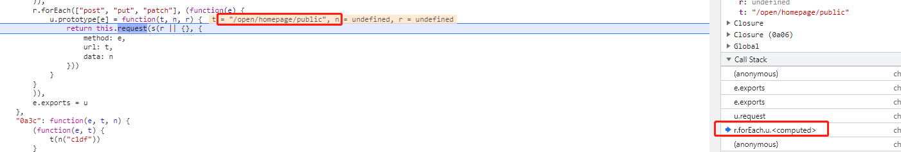

这里可以看到请求的位置，但是这个地方是 public接口，不是我们要找的

可以先下一个断点吧

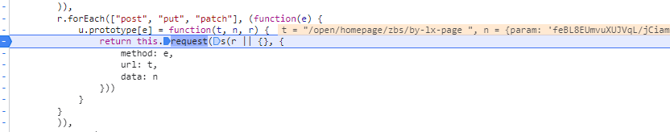

点击下一步，直接来到我们想要的，可是param已经生成了，继续往前跟栈。

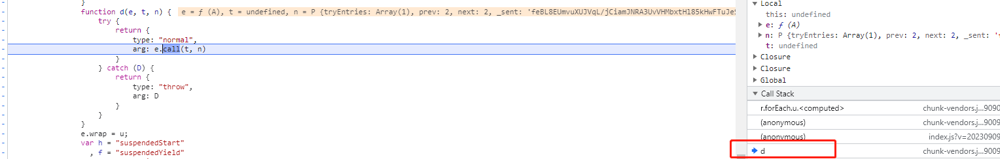

来到这个d的地方重新来一次

这个地方出现了

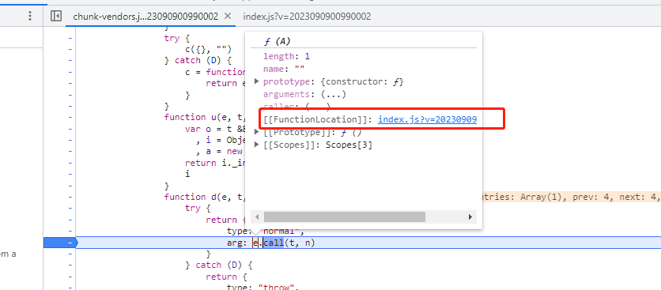

这里的方法要跟很多次每一次都是不一样的，

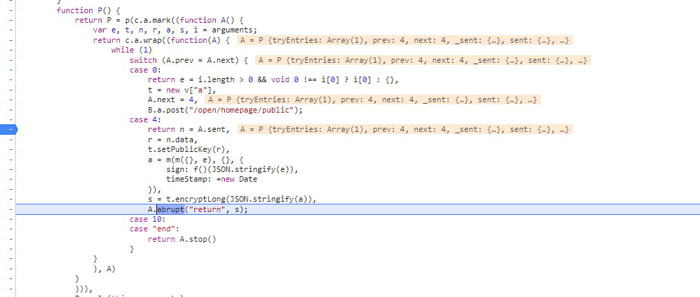

知道我们找到这里

搂一眼代码，

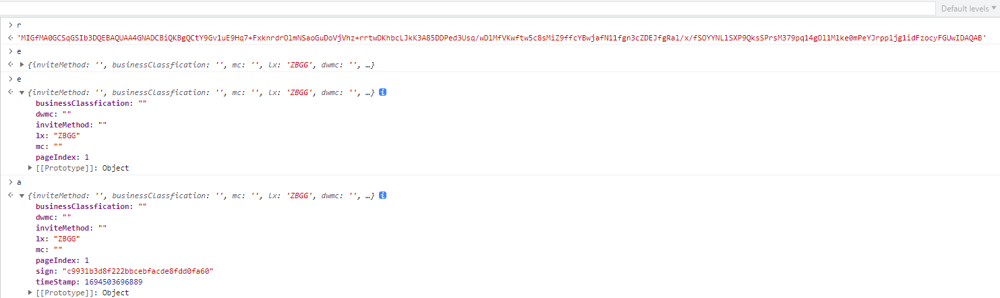

这里看到r是上一个接口返回的公钥和我预想的基本一样。

e是参数，

a是e加上了两个字段**sign**和 **timeStamp**

这里主要是是看sign如何生成的

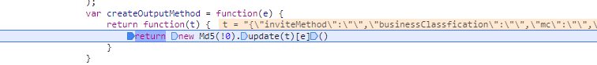

点进去一看md5

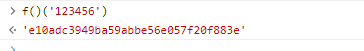

测一下没有魔改过，这下流程通了

开始干吧

第一步：请求公钥

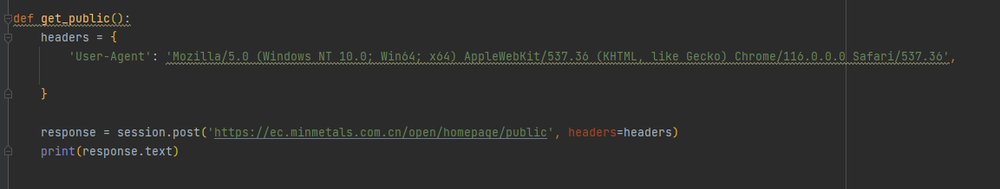

第二步：实现RSA

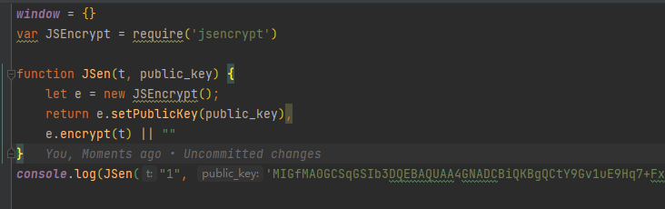

第三步：实现完整参数

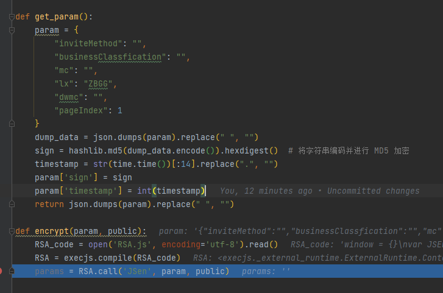

然后这里测试的时候发现，

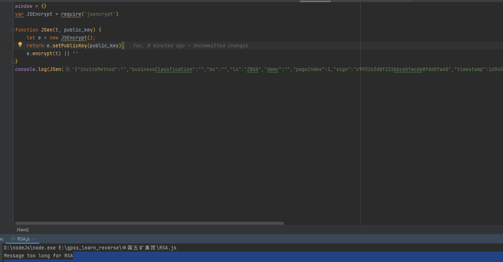

message too long for RSA

这里的密文没想象那么简单

看一下js

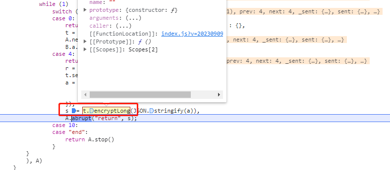

这个函数

仔细看一下，

他这里处理的长的参数，

这里我们要复刻一下他的这个东西

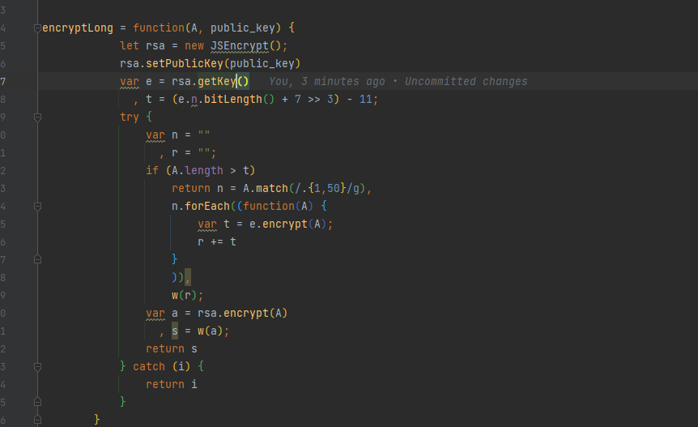

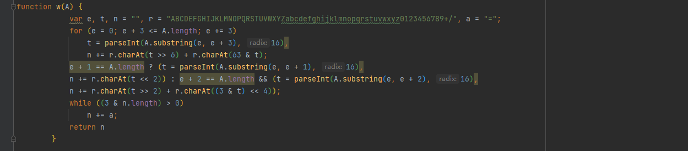

补一下他的这个处理代码

然后就大功告成了

# 总结

这个跟栈费点功夫，加密处理rsa长度这块是第一次见到。

看一下结果吧

将整个流程串起来吧。

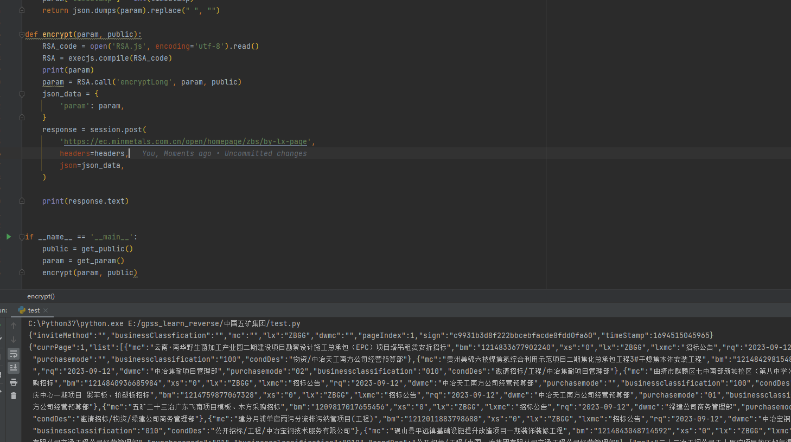