# 极验四代滑块

> 网站地址： aHR0cHM6Ly9ndDQuZ2VldGVzdC5jb20v
>
> https://github.com/Guapisansan/gpss_learn_reverse 代码在这里，会持续更新逆向案例

**免责声明： 此文档，以及脚本，仅用来对技术的学习与探讨，如有冒犯，请联系作者电话，微信13933566015进行删除**

上周做了一个云片滑块，

这周上一些强度，来个极验的

极验在业内还是有很大的知名度的。

冲冲冲！！！！！！！！！！！！！！！

## 流程分析

### 获取图片流程

点击刷新图片，然后滑动一下

这里看着还是两个接口

第一个接口为，刷新图片的接口

第二个接口为，拉动验证码接口

咱们一个接口一个接口分析。

先看获取图片的

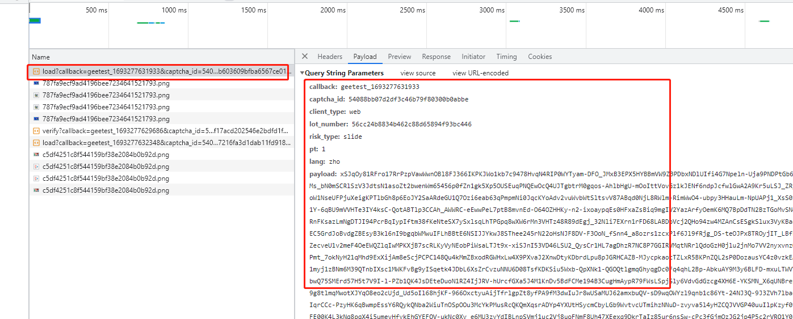

这个接口参数有不少，

**callback**

**captcha_id**

**client_type**

**lot_number**

**risk_type**

**pt**

**lang**

**payload**

**process_token**

**payload_protocol**

再看一下响应信息

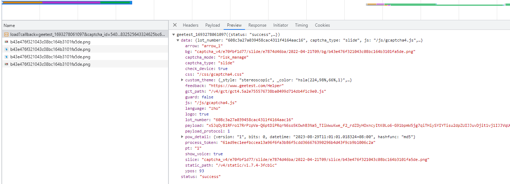

里面包含，bg图片（背景图），slice图片(滑块图)

还是重放攻击，去除不必要参数。

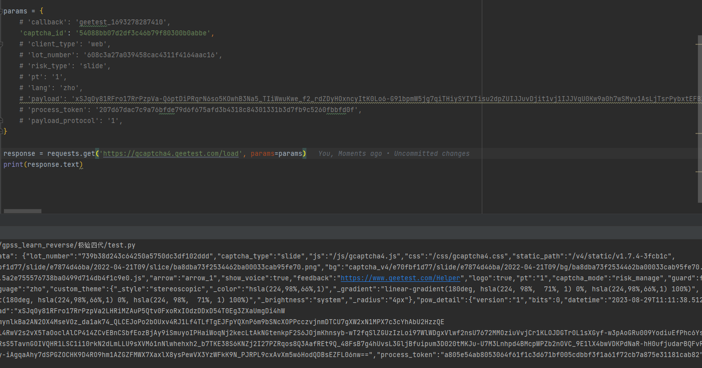

这里测试，只要一个captcha_id就可以拿到图片。

可以看一下这个captcha_id的来源和变化

我测了3次接口都是不变的

~~~
54088bb07d2df3c46b79f80300b0abbe
~~~

发现写死的，所以我们也写死即可。

get图片的方式没有难度，先这样，如果有问题再回来看吧

### 验证图片流程

来看这个验证接口

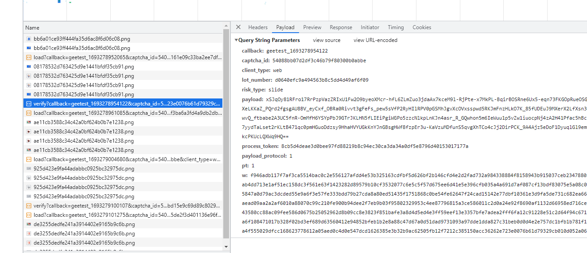

这里的参数和获取图片的一样， 

多了一个w，这个w肯定是关键，比如滑块轨迹之类的。

还是测试接口，

去除不必要参数

这里必要参数是这三个

接口才会通，

**这里说的必要参数，是能把接口打通，起码会出现结果而非异常。**

**并不代表真正意义上的正确**

这个lot_number看一出处

这里发现验证接口的lot_number入参，在获取图片接口的出参里面有出现。

而验证接口的lot_number则是必要参数，而获取图片的不是必要参数。

所以重点还是放在w上。

## 逆向w

先找到w值的生成位置吧，

找到verify验证的接口，然后从后往前跟

我们拉动滑块下一个断点

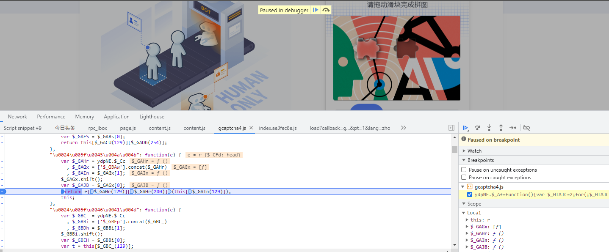

到这个位置查看变量

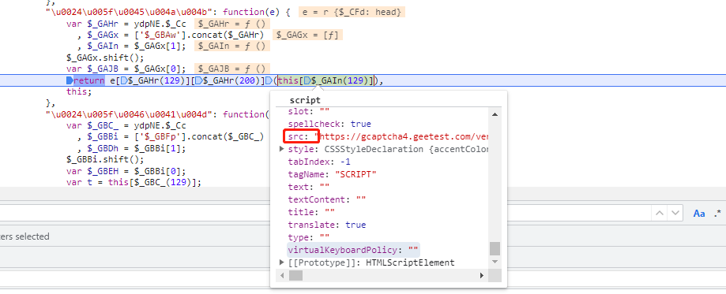

发现这有一个src

这个src里面包含着w

继续向上跟栈

这里也是发现了src的信息

再向上跟栈，来到这里

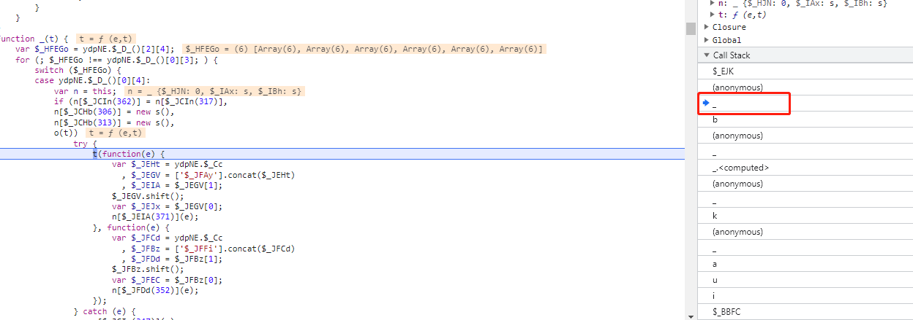

这里有点看不懂了

先不管了。

再继续向上翻。

这里又发现了关于src的地址信息。

这里的a是参数传了进来，

在跟

来到这里

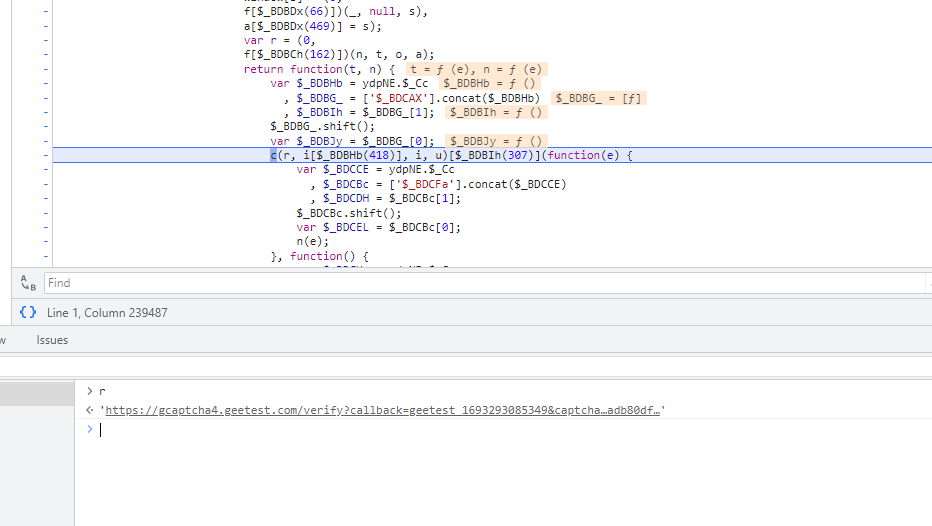

这个r就是a,把断点下到这里，看到上面有一个

下断，

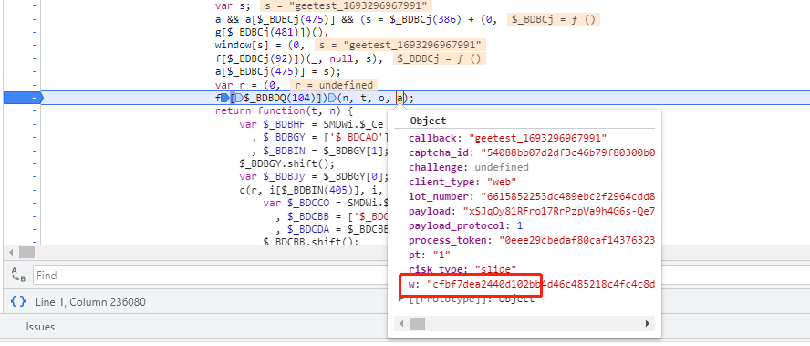

发现我们要的w值就在这里

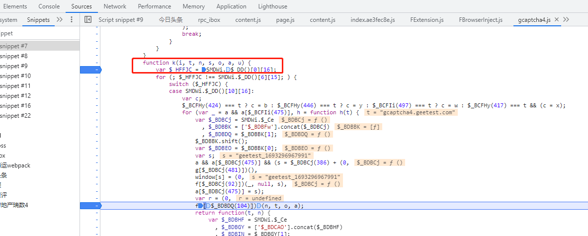

断点打到入口位置继续跟a值

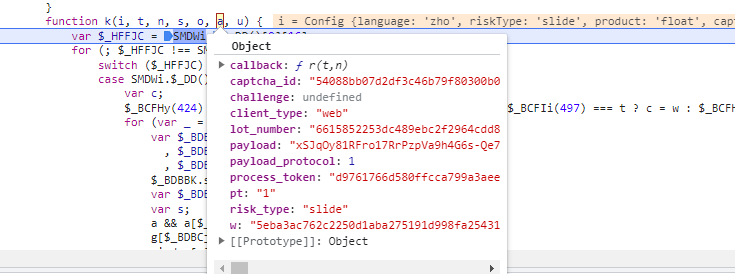

这里发现有w可以继续跟了，

继续向上

到这里又出现了。

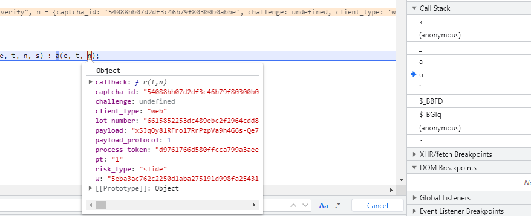

这里的n包含了w，在上跟。	

到这里发现了，i的生成过程。

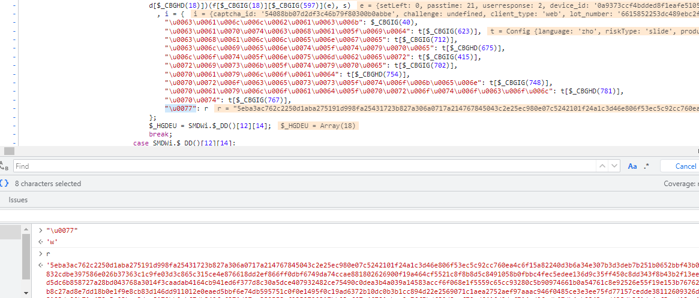

w也出现了。

                                    ~~~
                                    "\u0070\u0061\u0079\u006c\u006f\u0061\u0064\u005f\u0070\u0072\u006f\u0074\u006f\u0063\u006f\u006c": t[$_CBGHD(781)]  记录一下关键字方便搜索位置。
                                    ~~~

r就是我们参数的w值，

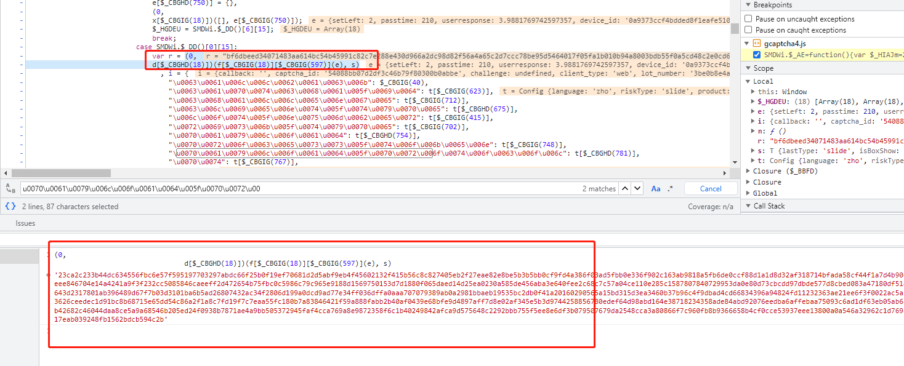

来看一下这里，

这就是r的生成方式

这里大概是这个套路

d[$_CBGHD(18)] 是生成加密的方法，需要两个参数 

第一个是 e参数将他json一下，

还有一个是s对象。

